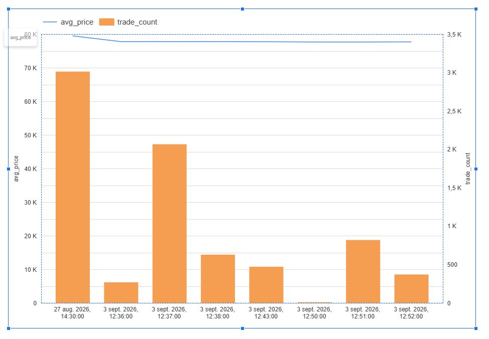

# Real-Time Crypto Data Pipeline

An end-to-end real-time data engineering pipeline that ingests live Bitcoin trades from Binance, streams them through Kafka, stores them in DuckDB, transforms and tests the data with dbt, orchestrates workflows with Dagster, and exposes analytics through Google Sheets and Looker Studio.

## Architecture

```text
Binance WebSocket
       ↓
Kafka Producer
       ↓
Kafka (crypto-trades)
       ↓
Kafka Consumer
       ↓
DuckDB
       ↓
dbt
       ↓
Dagster
       ↓
Google Sheets
       ↓
Looker Studio
```

## Tech Stack

- **Python** — ingestion and processing
- **Apache Kafka** — real-time event streaming
- **Docker** — Kafka infrastructure
- **DuckDB** — analytical storage
- **dbt** — transformations and data quality
- **Dagster** — orchestration and anomaly detection
- **Google Sheets API** — automated data export
- **Looker Studio** — dashboard and visualization

## Pipeline

Live Bitcoin trades are received from the Binance WebSocket API and published to the Kafka topic `crypto-trades`.

A Kafka consumer stores the events in DuckDB:

```text
raw_crypto_trades
```

dbt transforms the raw data into analytics-ready models:

```text
raw_crypto_trades
        ↓
stg_crypto_trades
        ↓
mart_crypto_metrics
```

The final mart contains minute-level metrics including:

- trade count
- average, minimum, and maximum price
- trading volume
- traded value

## Data Quality

dbt tests validate the transformed data before downstream processing.

```text
PASS=9
WARN=0
ERROR=0
TOTAL=9
```

## Dagster Orchestration

Dagster manages the analytical workflow as dependent assets:

```text
crypto_dbt_models
        ↓
crypto_dbt_tests
        ↓
crypto_anomaly_check
        ↓
crypto_metrics_to_sheets
```

The anomaly detection step compares the latest 10-minute trading volume with historical windows and flags unusually high activity.

## Dashboard

After the pipeline completes successfully, the analytical mart is automatically exported to the `LiveData` worksheet in Google Sheets.

Looker Studio uses this data to visualize Bitcoin price and trading activity over time.



## Key Engineering Features

- Real-time WebSocket ingestion
- Kafka producer/consumer architecture
- Dockerized Kafka infrastructure
- Raw event persistence in DuckDB
- dbt staging and analytical models
- Automated dbt data-quality tests
- Dagster asset-based orchestration
- Trading-volume anomaly detection
- Automated Google Sheets export
- Looker Studio visualization

## Run Locally

Start Kafka:

```bash
docker compose up -d
```

Run the streaming pipeline:

```bash
python run_pipeline.py
```

Start Dagster:

```bash
dagster dev
```

Dagster UI:

```text
http://127.0.0.1:3000
```

## What This Project Demonstrates

This project demonstrates how real-time streaming, analytical transformation, data quality, orchestration, monitoring, and visualization can be combined into a reproducible end-to-end data engineering pipeline.