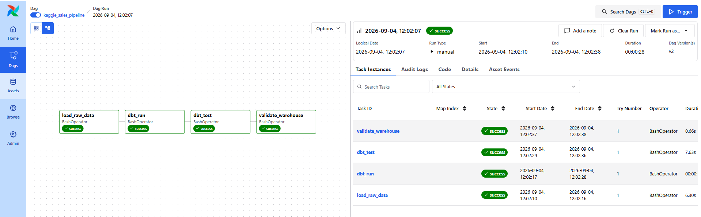

# Kaggle Sales Star Schema – dbt, DuckDB & Airflow

End-to-end analytics engineering project that transforms a retail sales dataset into a dimensional **Star Schema** using **Python, DuckDB, dbt, SQL, Docker, and Apache Airflow**.

The pipeline covers data ingestion, transformation, automated testing, and warehouse validation, orchestrated through Airflow.

---

## Architecture

```text
Excel Dataset
      ↓
Python Ingestion
      ↓
DuckDB Raw Tables
      ↓
dbt Staging
      ↓
Star Schema
      ↓
dbt Tests
      ↓
Warehouse Validation

Orchestrated with Apache Airflow + Docker
```

---

## Airflow Pipeline

The workflow is orchestrated through the Airflow DAG:

`kaggle_sales_pipeline`

```text
load_raw_data
      ↓
dbt_run
      ↓
dbt_test
      ↓
validate_warehouse
```

### Successful Airflow Run



Airflow manages task dependencies and prevents downstream tasks from running when an upstream task fails.

---

## Star Schema

`fact_orders` is the central fact table connected to four dimensions:

- `dim_date`
- `dim_customer`
- `dim_location`
- `dim_product`


**Fact table grain:** one row per source order line.

Main measures:

`sales` · `quantity` · `discount` · `profit`

---

## Data Quality

The project includes **32 dbt tests** covering:

- `not_null` constraints
- uniqueness of keys
- referential integrity between fact and dimension tables
- uniqueness of the `fact_orders` grain
- validation of the `dim_product` grain

```text
PASS=32
WARN=0
ERROR=0
```

---

## dbt Lineage

```text
raw_orders ──→ stg_orders ──→ dimensions ──→ fact_orders
                                  ↑
raw_calendar → stg_calendar → dim_date
```

dbt manages model dependencies using `source()` and `ref()`.

Documentation and interactive lineage can be generated with:

```bash
dbt docs generate
dbt docs serve --host 127.0.0.1 --port 8001
```

---

## Project Structure

```text
kaggle-star-schema/
│
├── dags/
│   └── kaggle_sales_dag.py
├── data/
├── docs/
│   ├── star_schema.png
│   └── airflow_dag_success.png
├── models/
│   ├── staging/
│   ├── dimensions/
│   └── facts/
├── scripts/
│   └── load_raw_data.py
├── tests/
├── Dockerfile
├── docker-compose.yaml
├── run_pipeline.py
├── dbt_project.yml
├── profiles.yml
└── requirements.txt
```

---

## Run the Project

### With Airflow

```bash
docker compose up --build
```

Open:

`http://localhost:8080`

Then trigger:

```text
DAGs → kaggle_sales_pipeline → Trigger → Single Run
```

### Without Airflow

```bash
python run_pipeline.py
```

---

## Results

| Metric | Result |
|---|---:|
| Fact rows | **9,994** |
| Distinct orders | **5,009** |
| Products | **1,894** |
| Customers | **793** |
| dbt models | **7** |
| dbt tests | **32 / 32 passing** |

---

## Tech Stack

**Python** · **SQL** · **DuckDB** · **dbt** · **Apache Airflow** · **Docker** · **pandas** · **openpyxl**

---

## What This Project Demonstrates

- End-to-end analytics engineering
- Apache Airflow orchestration
- Docker containerization
- Python data ingestion
- Dimensional modeling and Star Schema design
- Fact table grain and surrogate keys
- dbt transformations and lineage
- Automated data quality testing
- Warehouse validation