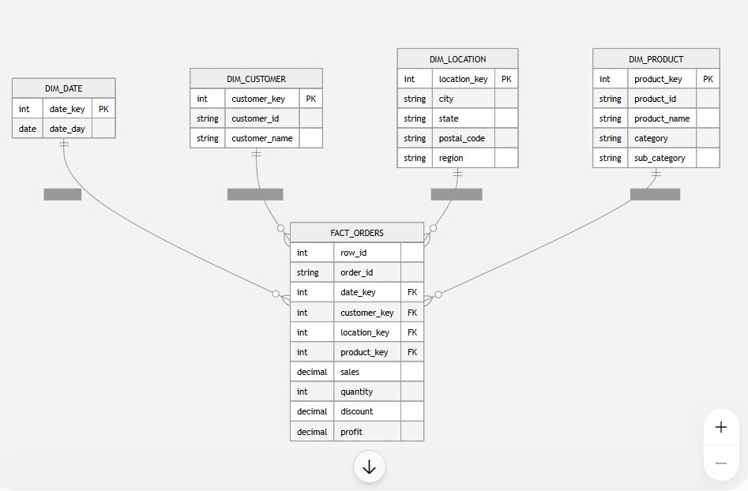

# Kaggle Sales Star Schema – dbt, DuckDB & Airflow

End-to-end analytics engineering project that transforms a retail sales dataset into a dimensional **Star Schema** using **Python, DuckDB, dbt, SQL, Docker, and Apache Airflow**.

The pipeline is orchestrated with **Apache Airflow**, which manages ingestion, dbt transformations, data quality testing, and warehouse validation.

## Architecture

```text
Excel Dataset
      ↓
Python Ingestion
      ↓
DuckDB Raw Tables
      ↓
dbt Staging
      ↓
Star Schema
      ↓
dbt Data Quality Tests
      ↓
Warehouse Validation

      Orchestrated by
      Apache Airflow
      running in Docker
```

## Airflow Pipeline

The workflow is implemented as an Airflow DAG:

`kaggle_sales_pipeline`

```text
load_raw_data
      ↓
   dbt_run
      ↓
   dbt_test
      ↓
validate_warehouse
```

### Tasks

**`load_raw_data`**

Runs the Python ingestion script:

```bash
python scripts/load_raw_data.py
```

This loads the source Excel dataset into DuckDB raw tables.

**`dbt_run`**

Runs the dbt transformation layer:

```bash
dbt run --profiles-dir .
```

This builds the staging models, dimensions, and central fact table.

**`dbt_test`**

Runs the dbt data quality suite:

```bash
dbt test --profiles-dir .
```

The pipeline continues only if the dbt tests pass.

**`validate_warehouse`**

Performs a final validation against DuckDB and confirms that the `fact_orders` table exists and contains data.

Airflow manages task dependencies and prevents downstream tasks from running when an upstream task fails.

## Star Schema

`fact_orders` is the central fact table, connected to four dimensions:

- `dim_date`
- `dim_customer`
- `dim_location`
- `dim_product`



**Fact table grain:** one row per source order line.

The fact table contains the main measures:

`sales` · `quantity` · `discount` · `profit`

and surrogate foreign keys to each dimension.

## Data Quality

The project includes **32 dbt tests** covering:

- `not_null` constraints
- uniqueness of keys
- referential integrity between fact and dimension tables
- uniqueness of the `fact_orders` grain
- validation of the `dim_product` grain

```text
PASS=32
WARN=0
ERROR=0
```

The Airflow pipeline runs these tests automatically after the dbt models are built.

## dbt Lineage

dbt manages transformation dependencies using `source()` and `ref()`:

```text
raw_orders ──→ stg_orders ──→ dimensions ──→ fact_orders
                                  ↑
raw_calendar → stg_calendar → dim_date
```

Interactive model lineage and documentation can also be generated locally:

```bash
dbt docs generate
dbt docs serve --host 127.0.0.1 --port 8001
```

Then open `http://127.0.0.1:8001`.

## Project Structure

```text
kaggle-star-schema/
│
├── dags/
│   └── kaggle_sales_dag.py
│
├── data/
│
├── scripts/
│   └── load_raw_data.py
│
├── models/
│   ├── staging/
│   ├── dimensions/
│   └── facts/
│
├── tests/
│   └── assert_dim_product_grain.sql
│
├── Dockerfile
├── docker-compose.yaml
├── run_pipeline.py
├── dbt_project.yml
├── profiles.yml
├── requirements.txt
└── README.md
```

## Run with Airflow

### 1. Clone the repository

```bash
git clone <repository-url>
cd kaggle-star-schema
```

### 2. Start Airflow with Docker

```bash
docker compose up --build
```

### 3. Open the Airflow UI

Open:

```text
http://localhost:8080
```

### 4. Run the pipeline

In the Airflow UI:

```text
DAGs
  ↓
kaggle_sales_pipeline
  ↓
Trigger
  ↓
Single Run
```

A successful DAG run executes:

```text
load_raw_data       SUCCESS
      ↓
dbt_run             SUCCESS
      ↓
dbt_test            SUCCESS
      ↓
validate_warehouse  SUCCESS
```

## Alternative Local Run

The project can also be executed without Airflow using the original Python pipeline runner:

```bash
python run_pipeline.py
```

This provides a lightweight way to rebuild and validate the warehouse directly from the command line.

## Results

| Metric | Result |
|---|---:|
| Fact rows | **9,994** |
| Distinct orders | **5,009** |
| Products | **1,894** |
| Customers | **793** |
| dbt models | **7** |
| dbt tests | **32 / 32 passing** |

## Tech Stack

**Python** · **SQL** · **dbt** · **DuckDB** · **Apache Airflow** · **Docker** · **pandas** · **openpyxl**

## What This Project Demonstrates

- End-to-end analytics engineering workflow
- Workflow orchestration with Apache Airflow
- Containerized development with Docker
- Python-based data ingestion
- Dimensional modeling and Star Schema design
- Fact and dimension table design
- Fact table grain definition
- Surrogate keys and referential integrity
- dbt staging and model dependencies
- Automated data quality testing
- Warehouse validation
- dbt documentation and lineage
- Reproducible local data pipelines